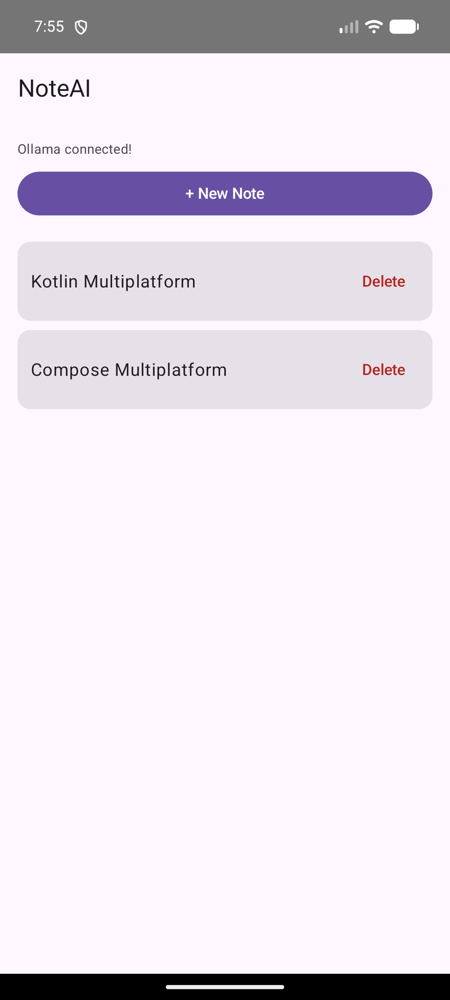
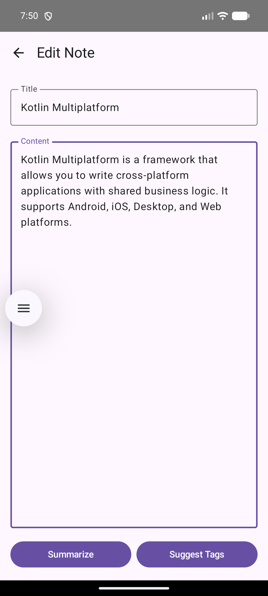
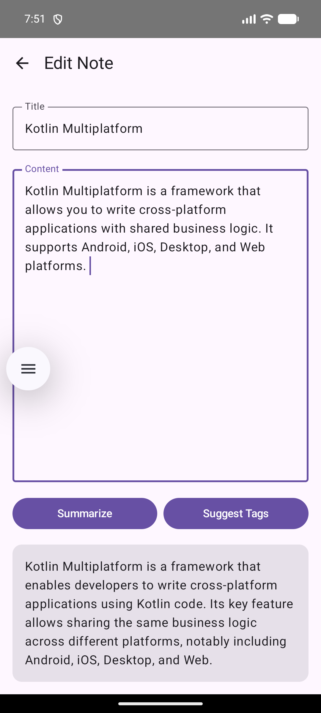
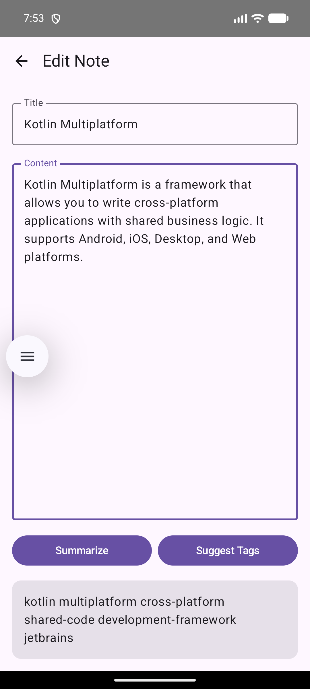

# NoteAI

Cross-platform notes application with AI-powered features using Ollama.

## Screenshots

| Notes List | Note Editor |
|------------|-------------|
|  |  |

| AI Summarize | AI Tag Suggestions |
|--------------|---------------------|
|  |  |

## Features

- Create and edit notes
- AI-powered summarization
- AI-powered tag suggestions
- Persistent storage (notes saved locally)
- Desktop (Windows, macOS, Linux) support
- Android support

## Requirements

- JDK 17+
- Ollama running locally on port 11434

## Setup

1. Install Ollama: https://ollama.com
2. Pull a model: `ollama pull deepseek-r1`
3. Run the application: `gradle :desktopApp:run`

## Tech Stack

- Kotlin Multiplatform
- Compose Multiplatform
- Ollama (local AI)
- Ktor (HTTP client)
